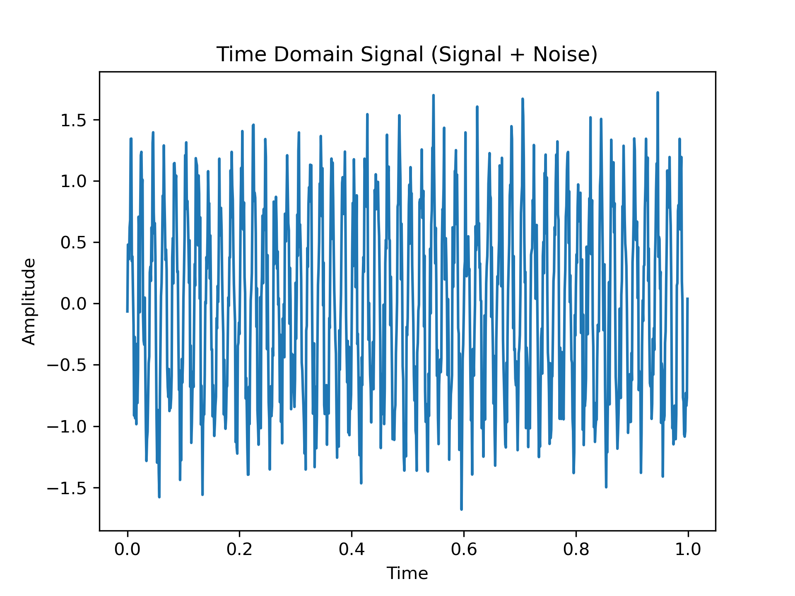
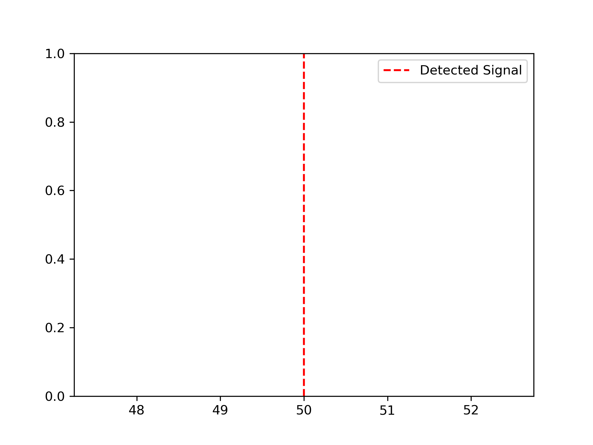
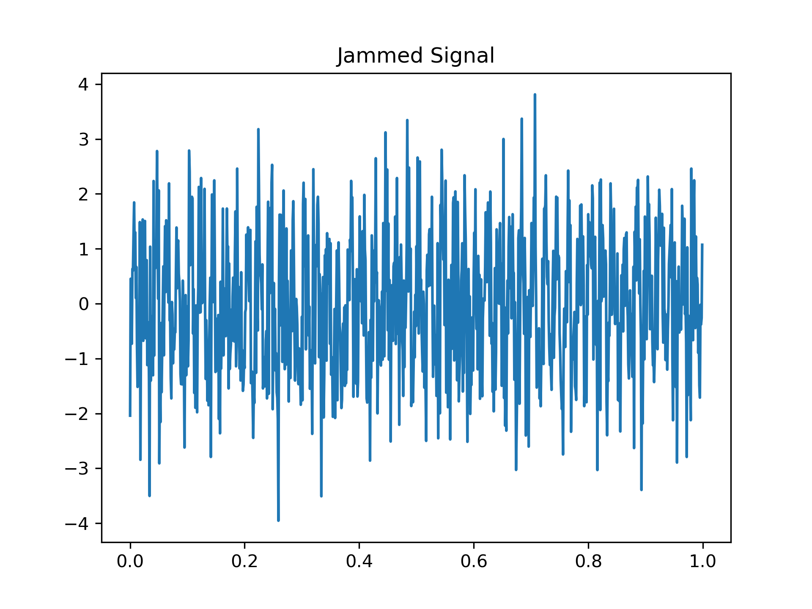
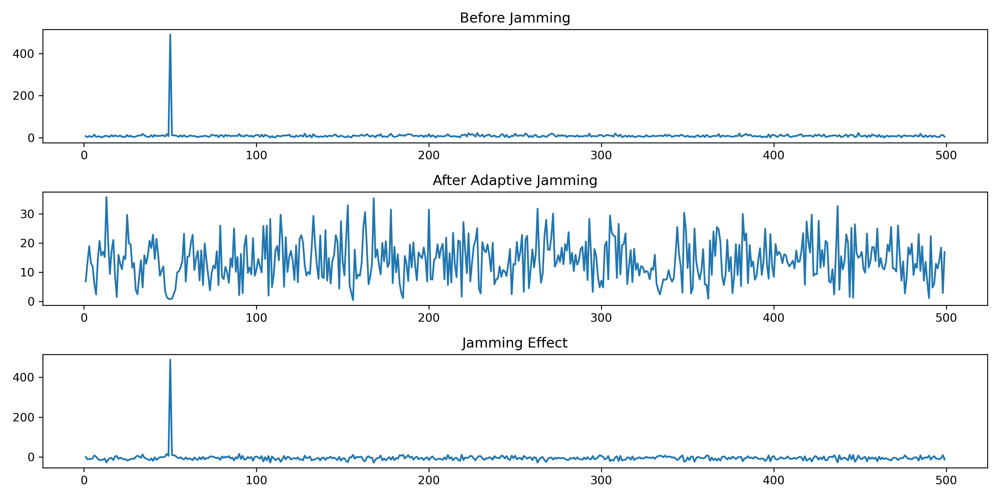
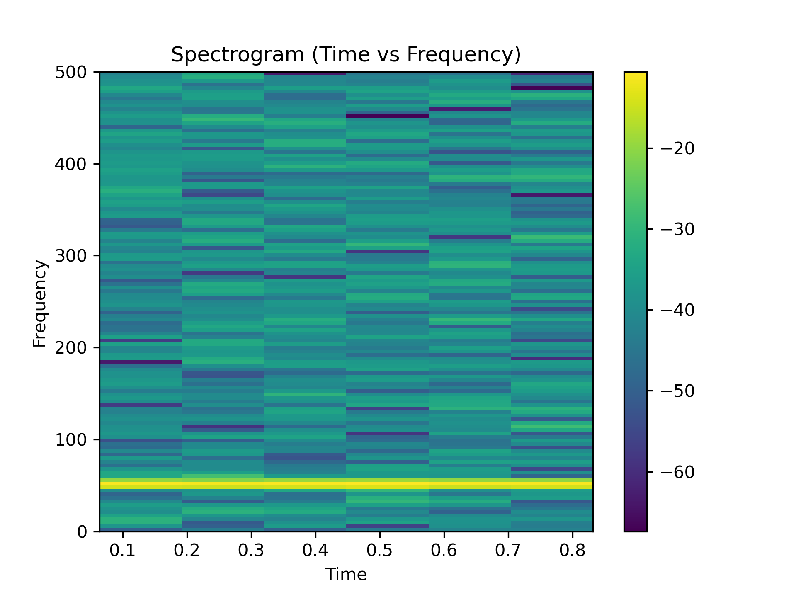

# SpectraGuard-EW-System
# SpectraGuard

Adaptive Electronic Warfare (EW) system for signal detection and jamming using DSP.

---

##  Features

* Signal generation (signal + noise)
* FFT-based frequency detection
* Adaptive jamming using band-stop filter
* Spectrogram visualization

---

##  Results

### Signal generation

### FFT Analysis

### Signal Detection

### Jamming

### Results

### spectrum

##  Concepts Used

* FFT 
* Signal Detection 
* Digital Filtering 
* Spectrogram

##  Applications

 * Electronic Warfare 
 * ELINT 
 * Radar Systems
